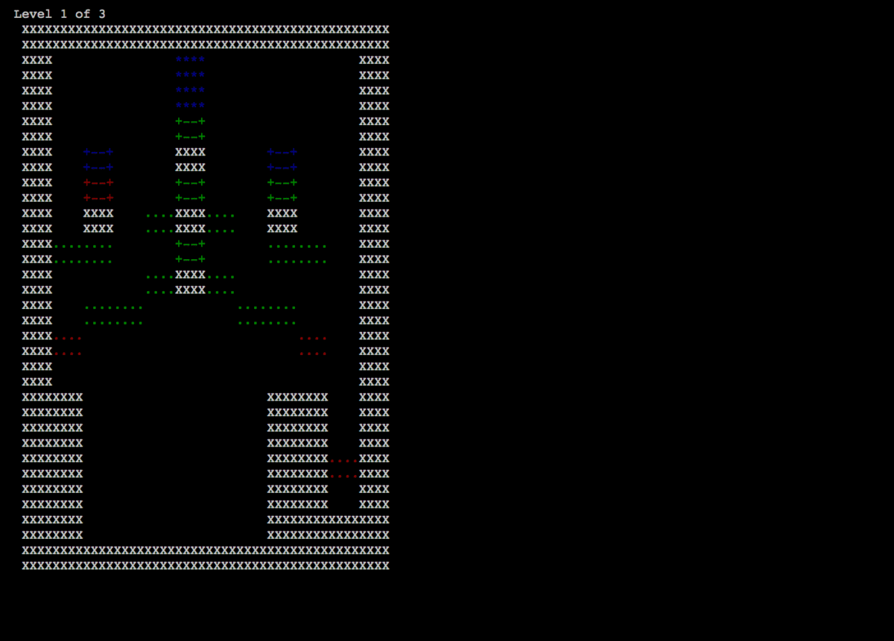

[</img>](https://asciinema.org/a/DHQp9turdBHvzhLTkCFOif74x)<br>
Demo with example levels loaded


[</img>](https://asciinema.org/a/SwfuCyPYhwTORnyihDMbkTsAP)<br>
The game

# Running

Don't forget to install dependencies:

```pip3 install -r requirements.txt```

To run:

```python src/jellies.py [-r, --replay <replay_file>]```

The history of your commands will be stored in the file `replay.log` and you can reload a game from this file. Restoring from a replay file skips move animation. 

# Caveats/warnings
- the game can't handle screen resizes in the middle of the animation of a move
- the code wasn't written with good design in mind; this is not a code sample and gameplay may be rough around the edges

# Why did you do this?

Great question. Yes, the basic shape primitive in this game is a square and no, curses does not support things that might have made this more reasonable and yes, limited cursor support makes things cumbersome. But mashing arrow keys into a terminal application displaying ASCII art has a certain stripped-down old-school charm and this wasn't meant for heavy-duty gameplay anyways. 

